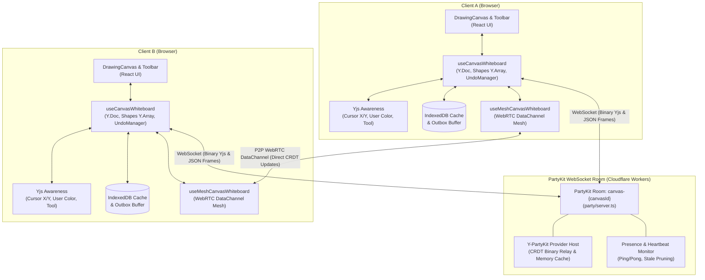
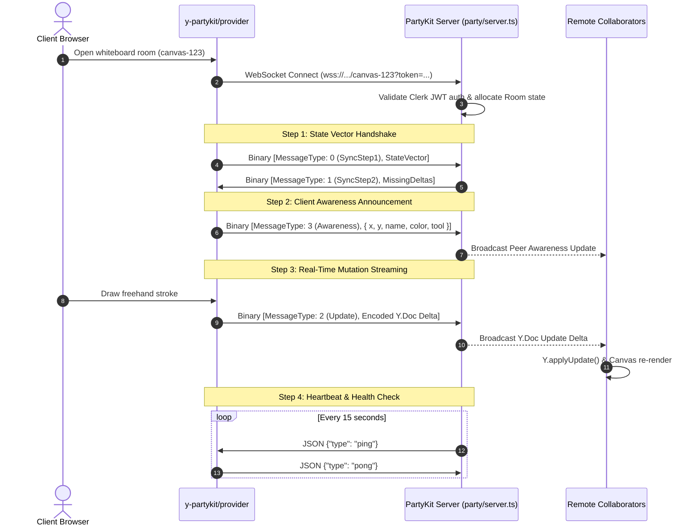
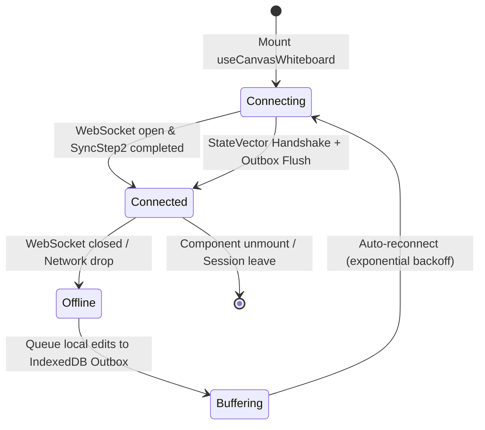

# Real-Time Collaborative Canvas Whiteboard Architecture & WebSocket Protocol

## 1. Overview & System Goals

The **WorkSphere Real-Time Collaborative Canvas Whiteboard** provides multi-user, low-latency, conflict-free visual brainstorming, diagramming, and collaborative sketching. It operates across mobile and desktop environments with offline resiliency, sub-50ms peer update propagation, smooth remote cursor rendering, and granular undo/redo histories.

### Key Capabilities
- **Conflict-Free Replicated Data Types (CRDTs):** Powered by **Yjs** (`Y.Doc`, `Y.Array<Y.Map>`, `Y.UndoManager`) ensuring zero-conflict convergence across concurrent drawing actions.
- **Dual-Path Sync:** Primary WebSocket transport via **PartyKit** (`y-partykit/provider`) with automatic fallback/acceleration over **WebRTC DataChannel mesh** (`useMeshCanvasWhiteboard`).
- **Sub-50ms Ephemeral Awareness:** High-frequency remote cursor streaming with user identity badges, customized stroke colors, and active tool indicators.
- **Offline-First & Reconnection Resilience:** Local document persistence via IndexedDB, automated outbox buffering, snapshot reconciliation, and exponential backoff retry via `FailoverSyncManager`.

---

## 2. High-Level Architecture Diagram



---

## 3. Component Hierarchy & Implementation Map

| Component / Module | Path | Description & Responsibility |
| :--- | :--- | :--- |
| **`useCanvasWhiteboard`** | `src/hooks/useCanvasWhiteboard.ts` | Primary state hook orchestrating Yjs document, shapes collection, local undo/redo stack, remote cursors, and color palettes. |
| **`useMeshCanvasWhiteboard`** | `src/hooks/useMeshCanvasWhiteboard.ts` | Extends `useCanvasWhiteboard` with dual-path sync over direct WebRTC P2P DataChannels. |
| **`DrawingCanvas`** | `src/components/whiteboard/DrawingCanvas.tsx` | HTML5 Canvas rendering component with pointer event normalization and requestAnimationFrame draw loop. |
| **`CanvasToolbar`** | `src/components/whiteboard/CanvasToolbar.tsx` | Tool selector (pen, eraser, rect, circle, line, sticky), 10-color palette picker, stroke width, undo/redo/clear buttons. |
| **`RemoteCursors`** | `src/components/whiteboard/RemoteCursors.tsx` | Smooth SVG cursor overlay displaying peer names, active tools, and coordinates. |
| **`FailoverSyncManager`** | `src/lib/edge/failoverSync.ts` | Manages IndexedDB local snapshot persistence, reconnection outbox replay, and conflict recovery. |
| **`PartyKit Server`** | `party/server.ts` | Distributed room server running on Cloudflare Workers edge; brokers binary Yjs messages and presence heartbeats. |

---

## 4. CRDT Data Model & Shape Schema

Each whiteboard room initializes a shared `Y.Doc`. The drawing canvas entities are stored inside a top-level `Y.Array<Y.Map<unknown>>("shapes")`.

### Shape Data Structure

```typescript
export type ToolType = "pen" | "eraser" | "rect" | "circle" | "line" | "sticky";

export interface ShapeData {
  id: string;              // Deterministic UUID (crypto.randomUUID())
  type: ToolType;          // Tool primitive type
  points: number[];        // Flattened coordinates [x0, y0, x1, y1, ...]
  color: string;           // Hex color string (e.g., "#3b82f6")
  width: number;           // Stroke width in pixels (1-32px)
  opacity: number;         // Stroke opacity (0.0 - 1.0)
  userId: string;          // Author's Clerk/Anonymous User ID
  deleted?: boolean;       // Tombstone flag for soft deletion
  deletedAt?: number;      // Epoch timestamp of deletion
  updatedAt?: number;      // Epoch timestamp of last mutation
  clock?: number;          // Logical Lamport clock for LWW resolution
}
```

### Conflict Resolution Semantics
1. **Freehand Strokes (`pen`):** Points are appended incrementally into `points: number[]`. Concurrent strokes create separate shape entries that render in deterministic order based on Yjs item IDs.
2. **Shape Mutations (Move / Resize / Recolor):** Managed via `Y.Map.set(key, value)`. Yjs enforces Last-Write-Wins (LWW) based on logical Lamport timestamps.
3. **Deletions (`eraser` / `clearCanvas`):** Implemented using soft tombstone markers (`deleted: true`, `deletedAt: Date.now()`) to ensure idempotent sync and enable selective undo.
4. **Selective Undo/Redo (`Y.UndoManager`):** Scoped strictly to the local client's mutations using `trackedOrigins: [docRef.current.clientID]`, preventing one user's undo from reverting a collaborator's work.

---

## 5. WebSocket Communication Protocol

Communication between the client browser and PartyKit edge server uses **RFC 6455 WebSockets** running at `wss://<partykit-host>/parties/main/canvas-{canvasId}?token=<jwt>`.

### 5.1 Protocol Message Types

```text
┌────────────────────────────────────────────────────────────────────────┐
│                      WebSocket Message Exchange                        │
├───────────────────────┬───────────────────┬────────────────────────────┤
│ Message Type          │ Format            │ Purpose                    │
├───────────────────────┼───────────────────┼────────────────────────────┤
│ Yjs Sync Step 1       │ Binary (Uint8Array│ Client sends state vector   │
│ Yjs Sync Step 2       │ Binary (Uint8Array│ Server sends missing deltas│
│ Yjs Sync Update       │ Binary (Uint8Array│ Live shape delta updates   │
│ Yjs Awareness Update  │ Binary (Uint8Array│ Cursors & peer presence    │
│ request_room_snapshot │ JSON              │ Request full board state   │
│ ping / pong           │ JSON              │ Keep-alive & stale prune   │
│ webrtc-signal         │ JSON              │ SDP offer/answer exchange  │
└───────────────────────┴───────────────────┴────────────────────────────┘
```

### 5.2 Connection & Handshake Lifecycle



### 5.3 Awareness Payload Schema

Remote cursor tracking and active user presence are broadcast over the Yjs Awareness protocol:

```typescript
export interface RemoteCursor {
  userId: string;          // User ID
  x: number;               // Normalized canvas X coordinate
  y: number;               // Normalized canvas Y coordinate
  name: string;            // Display name
  color: string;           // User cursor accent color
}

export interface WhiteboardAwarenessState {
  user: {
    id: string;
    name: string;
    color: string;
    avatarUrl?: string;
  };
  cursor: {
    x: number;
    y: number;
  } | null;
  tool: ToolType;
  lastActive: number;      // Epoch millisecond timestamp
}
```

---

## 6. Color Palette System

The canvas whiteboard exposes a 10-color vibrant stroke palette configured in `src/hooks/useCanvasWhiteboard.ts`:

```typescript
export const PRESET_COLORS = [
  "#ffffff", // Clean White
  "#f43f5e", // Vibrant Rose
  "#f97316", // Bright Orange
  "#eab308", // Golden Amber
  "#22c55e", // Emerald Green
  "#14b8a6", // Bright Teal
  "#06b6d4", // Electric Cyan
  "#3b82f6", // Royal Blue
  "#a855f7", // Vivid Purple
  "#ec4899", // Neon Pink
] as const;
```

Each user is assigned a deterministic default cursor and stroke accent color based on their connection hash.

---

## 7. Reconnection, Failover & Recovery Protocol

To ensure seamless operation during intermittent connectivity, network transitions (Wi-Fi to Cellular), and edge restarts, the whiteboard incorporates multi-tier resiliency:



1. **Client Outbox Buffer:** When disconnected, drawing actions continue uninterrupted in memory and are written to IndexedDB.
2. **Reconnection State Vector Exchange:** Upon socket re-establishment, `SyncStep1` ensures only missed updates are transmitted, eliminating redundant payload transfer.
3. **Heartbeat & Timeout Pruning:**
   - Server sends `ping` every 15 seconds if idle for >10 seconds.
   - If no `pong` response is received within 45 seconds, the server terminates the dead connection and broadcasts peer departure.
   - Awareness states inactive for >15 seconds are automatically pruned by `pruneInactivePresence()`.

---

## 8. Performance & Optimization Guidelines

1. **RAF Canvas Render Loop:** Avoid triggering React re-renders on high-frequency pointer moves. Buffer points in memory and render via `requestAnimationFrame`.
2. **Cursor Throttling:** Cursor coordinate broadcasts are throttled to **30ms intervals** (~33Hz) to minimize WebSocket network overhead while maintaining visually smooth movement.
3. **Point Simplification:** Freehand pen strokes apply path smoothing using Ramer-Douglas-Peucker distance thresholds to reduce Yjs document size.
4. **Memory Hygiene:** Clean up all `Y.Doc` and `YProvider` instances in `useEffect` return hooks using `provider.destroy()` and `ydoc.destroy()` to prevent memory leaks.
