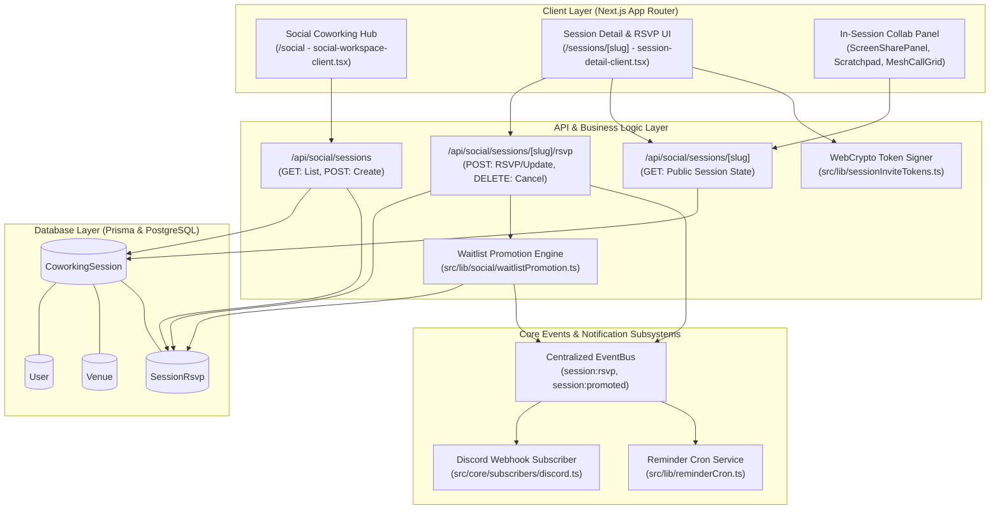
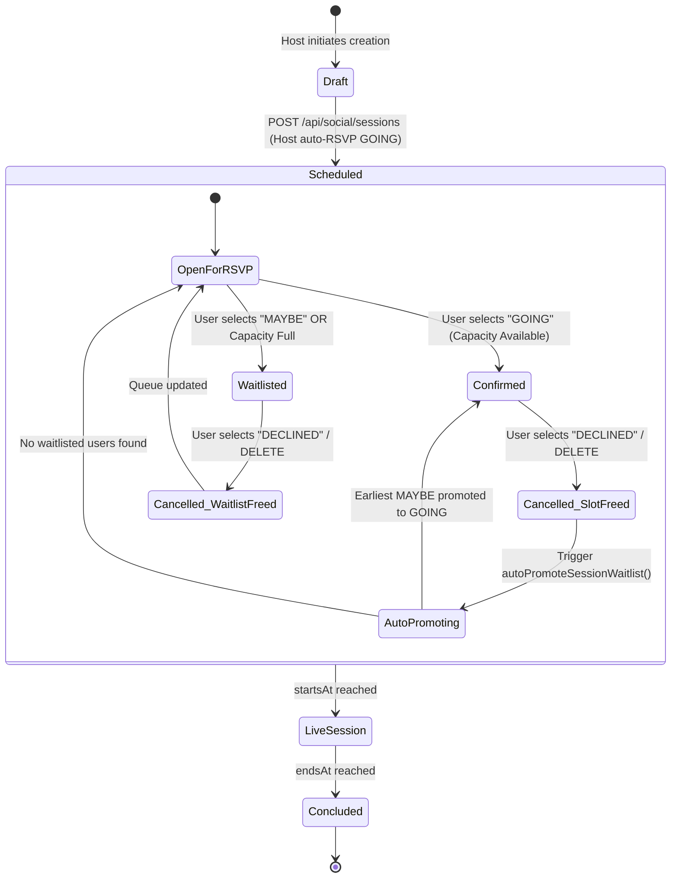
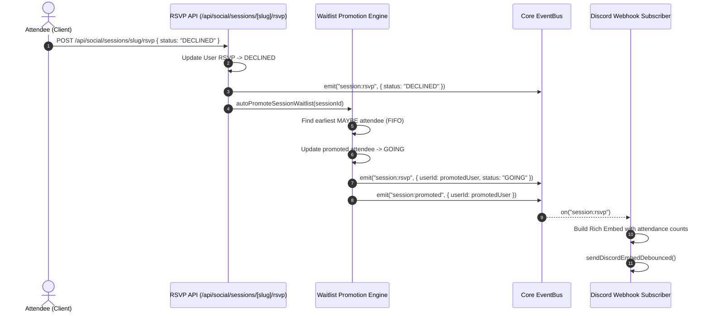

# Social Coworking Session RSVP Lifecycle, Waitlists & Host Moderation Architecture

## 1. Overview & System Goals

The **WorkSphere Social Coworking Sessions** system connects remote professionals and hybrid teams by transforming public and private workspaces into active, scheduled group coworking sessions. It enables members to discover upcoming sessions, RSVP with real-time capacity checks, join automated FIFO waitlists, and collaborate synchronously through WebRTC audio, screen sharing, and shared scratchpads.

### Core Pillars
- **Flexible RSVP Lifecycle:** Real-time state transitions between `GOING`, `MAYBE` (Waitlisted), and `DECLINED` / `CANCELLED`.
- **Automated Waitlist Auto-Promotion:** Instant FIFO promotion of waitlisted attendees when confirmed attendees cancel or when capacity increases.
- **Cryptographic Host Moderation & Invites:** WebCrypto HMAC-SHA256 signed invite tokens enforcing strict expiration, capacity caps, and timing-safe signature verification.
- **Decoupled Event Broadcasting:** EventBus-driven notifications for Discord webhooks, session reminders, and attendee status updates.
- **Synchronous In-Session Collaboration:** Seamless integration with live mesh audio (`MeshCallGrid`), WebRTC screen sharing (`ScreenSharePanel`), and CRDT scratchpads (`Scratchpad`).

---

## 2. High-Level Architecture Diagram



---

## 3. Database Schema & Relational Model

The social coworking subsystem is defined in `prisma/schema.prisma`:

```prisma
model CoworkingSession {
  id          String        @id @default(cuid())
  slug        String        @unique
  hostId      String
  host        User          @relation("SessionHost", fields: [hostId], references: [id], onDelete: Cascade)
  venueId     String
  venue       Venue         @relation(fields: [venueId], references: [id], onDelete: Cascade)
  title       String
  description String?
  startsAt    DateTime
  endsAt      DateTime
  maxGuests   Int?
  createdAt   DateTime      @default(now())
  updatedAt   DateTime      @updatedAt
  rsvps       SessionRsvp[]

  @@index([hostId])
  @@index([venueId])
  @@index([startsAt])
}

model SessionRsvp {
  id        String           @id @default(cuid())
  sessionId String
  session   CoworkingSession @relation(fields: [sessionId], references: [id], onDelete: Cascade)
  userId    String
  user      User             @relation(fields: [userId], references: [id], onDelete: Cascade)
  status    RsvpStatus       @default(GOING)
  createdAt DateTime         @default(now())
  updatedAt DateTime         @updatedAt

  @@unique([sessionId, userId])
  @@index([userId])
}

enum RsvpStatus {
  GOING
  MAYBE
  DECLINED
}
```

---

## 4. Session & RSVP Lifecycle State Machine



---

## 5. Automated Waitlist Auto-Promotion Engine

When an event specifies `maxGuests`, attendees who join after the capacity is reached or who indicate tentative interest receive the `MAYBE` status. The waitlist engine (`src/lib/social/waitlistPromotion.ts`) guarantees fair, deterministic FIFO order.

### 5.1 Promotion Trigger Rules
1. **Attendee RSVP Decline / Cancellation:** A user with status `GOING` updates their status to `DECLINED` or `MAYBE`, or deletes their RSVP via `DELETE /api/social/sessions/[slug]/rsvp`.
2. **Capacity Headroom Check:** Available slots are computed as `maxGuests - count(rsvps where status = GOING)`.
3. **FIFO Queue Selection:** The system queries `SessionRsvp` records where `sessionId = targetId` and `status = "MAYBE"`, ordered by `createdAt ASC` with a `take: availableSlots` limit.
4. **Atomic State Elevation & Event Dispatch:**
   - Updates `status` from `MAYBE` to `GOING`.
   - Dispatches `session:rsvp` to trigger Discord webhook embeds.
   - Dispatches `session:promoted` on `eventBus` for downstream audit logs and user notifications.

### 5.2 Implementation Reference

```typescript
export async function autoPromoteSessionWaitlist(
  sessionId: string,
): Promise<PromotionResult> {
  const session = await prisma.coworkingSession.findUnique({
    where: { id: sessionId },
    include: {
      _count: {
        select: { rsvps: { where: { status: "GOING" } } },
      },
    },
  });

  if (!session || !session.maxGuests) {
    return { promotedCount: 0, promotedRsvps: [] };
  }

  const currentGoing = session._count.rsvps;
  const availableSlots = session.maxGuests - currentGoing;
  if (availableSlots <= 0) return { promotedCount: 0, promotedRsvps: [] };

  const waitlisted = await prisma.sessionRsvp.findMany({
    where: { sessionId, status: "MAYBE" },
    orderBy: { createdAt: "asc" },
    take: availableSlots,
  });

  const promotedRsvps = [];
  for (const attendee of waitlisted) {
    const updated = await prisma.sessionRsvp.update({
      where: { id: attendee.id },
      data: { status: "GOING" },
    });

    promotedRsvps.push(updated);

    await eventBus.emit("session:rsvp", {
      sessionId: session.id,
      rsvpId: updated.id,
      userId: updated.userId,
      status: "GOING",
    });

    await eventBus.emit("session:promoted", {
      sessionId: session.id,
      rsvpId: updated.id,
      userId: updated.userId,
      previousStatus: "MAYBE",
    });
  }

  return { promotedCount: promotedRsvps.length, promotedRsvps };
}
```

---

## 6. Host Moderation & Cryptographic Invite Tokens

Hosts manage attendee access through public session pages or time-limited, tamper-evident private invite tokens implemented in `src/lib/sessionInviteTokens.ts`.

### 6.1 Cryptographic Token Architecture

```text
┌────────────────────────────────────────────────────────────────────────┐
│             WebCrypto HMAC-SHA256 Signed Invite Token                  │
├──────────────────────────────────────┬─────────────────────────────────┤
│ Base64Url(JSON Payload)              │ Base64Url(HMAC-SHA256 Signature)│
├──────────────────────────────────────┼─────────────────────────────────┤
│ {                                    │                                 │
│   "sessionId": "session-slug",       │ 256-bit cryptographically       │
│   "expiresAt": 1789012345678,        │ verified HMAC signature         │
│   "maxParticipants": 15,             │ using server secret             │
│   "nonce": "a1b2c3d4e5f6..."         │                                 │
│ }                                    │                                 │
└──────────────────────────────────────┴─────────────────────────────────┘
```

### 6.2 Validation Safeguards
- **Timing-Safe Verification:** Signature comparison uses constant-time byte-level comparison (`timingSafeEqual`) to prevent side-channel timing attacks.
- **Expiration Enforcement:** Tokens specify lifetime (default 24 hours). Expired tokens are rejected before database queries occur.
- **Capacity Caps:** When `maxParticipants` is encoded in the token, validation verifies current going count before authorizing access.

---

## 7. Decoupled Event Subsystem & Discord Integration

WorkSphere uses an asynchronous in-memory `EventBus` (`src/core/events.ts`) to decouple API operations from external notifications:



---

## 8. API Reference

### 8.1 Create Coworking Session
- **Endpoint:** `POST /api/social/sessions`
- **Auth:** Required (Clerk User ID)
- **Request Body:**
  ```json
  {
    "title": "Fullstack Deep Work Sprint",
    "description": "Pair programming and async co-working session.",
    "venueId": "venue_cuid_123",
    "startsAt": "2026-10-15T09:00:00.000Z",
    "endsAt": "2026-10-15T17:00:00.000Z",
    "maxGuests": 8
  }
  ```
- **Response (200 OK):** Returns full session object with auto-confirmed host RSVP.

### 8.2 Update or Submit RSVP
- **Endpoint:** `POST /api/social/sessions/[slug]/rsvp`
- **Auth:** Required
- **Request Body:**
  ```json
  { "status": "GOING" }
  ```
- **Statuses Supported:** `GOING`, `MAYBE`, `DECLINED`, `CANCELLED`
- **Response (200 OK):**
  ```json
  {
    "id": "rsvp_cuid_456",
    "sessionId": "session_cuid_123",
    "userId": "user_clerk_789",
    "status": "GOING",
    "promotedWaitlist": []
  }
  ```

### 8.3 Cancel / Delete RSVP
- **Endpoint:** `DELETE /api/social/sessions/[slug]/rsvp`
- **Auth:** Required
- **Response (200 OK):**
  ```json
  {
    "success": true,
    "message": "RSVP cancelled successfully",
    "promotedWaitlist": [
      {
        "id": "rsvp_cuid_789",
        "userId": "user_promoted_101",
        "sessionId": "session_cuid_123",
        "status": "GOING"
      }
    ]
  }
  ```
