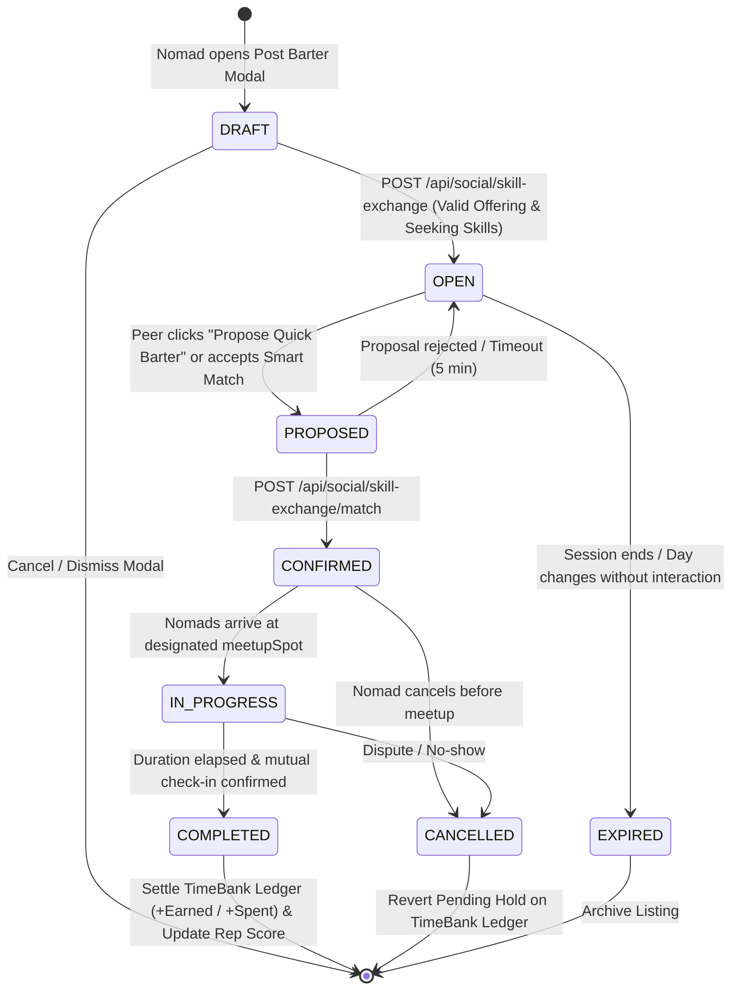

# Technical Specification: NomadSkillBarterBoard Barter Session State Lifecycle

This document provides a comprehensive technical architecture and lifecycle specification for WorkSphere's on-site peer knowledge barter system ([src/components/social/NomadSkillBarterBoard.tsx](file:///c:/Users/Rushabh%20Mahajan/Documents/GitHub/WorkSphere/src/components/social/NomadSkillBarterBoard.tsx), [src/lib/social/skillBarterEngine.ts](file:///c:/Users/Rushabh%20Mahajan/Documents/GitHub/WorkSphere/src/lib/social/skillBarterEngine.ts), [src/app/api/social/skill-exchange/route.ts](file:///c:/Users/Rushabh%20Mahajan/Documents/GitHub/WorkSphere/src/app/api/social/skill-exchange/route.ts), and [src/app/api/social/skill-exchange/match/route.ts](file:///c:/Users/Rushabh%20Mahajan/Documents/GitHub/WorkSphere/src/app/api/social/skill-exchange/match/route.ts)).

---

## Table of Contents

1. [Executive Summary & Architectural Scope](#1-executive-summary--architectural-scope)
2. [Barter Session State Lifecycle & Finite State Machine](#2-barter-session-state-lifecycle--finite-state-machine)
   - [State Definitions & Taxonomy](#state-definitions--taxonomy)
   - [Lifecycle State Transition Flow](#lifecycle-state-transition-flow)
   - [State Transition Event Matrix](#state-transition-event-matrix)
3. [Bidirectional Smart Matching & Harmony Engine](#3-bidirectional-smart-matching--harmony-engine)
   - [Category Harmony Matrix](#category-harmony-matrix)
   - [Compatibility Score Weighting](#compatibility-score-weighting)
   - [Coworker Proximity & Venue Scoping](#coworker-proximity--venue-scoping)
4. [TimeBank Hour Balance Ledger Mechanics](#4-timebank-hour-balance-ledger-mechanics)
   - [Non-Negative Hour Balance Invariant](#non-negative-hour-balance-invariant)
   - [Session Duration & Redemption Rules](#session-duration--redemption-rules)
   - [Ledger Settlement on Session Completion](#ledger-settlement-on-session-completion)
5. [On-Site Physical Meetup Coordination](#5-on-site-physical-meetup-coordination)
   - [Spot Allocation & Desk Zoning](#spot-allocation--desk-zoning)
   - [Real-Time Confirmation Pass & Calendaring](#real-time-confirmation-pass--calendaring)
6. [API Route Specifications & Data Contracts](#6-api-route-specifications--data-contracts)
   - [`GET /api/social/skill-exchange`](#get-apisocialskill-exchange)
   - [`POST /api/social/skill-exchange`](#post-apisocialskill-exchange)
   - [`POST /api/social/skill-exchange/match`](#post-apisocialskill-exchangematch)
7. [Security, Reputation & Anti-Abuse Controls](#7-security-reputation--anti-abuse-controls)
8. [Repository Code Reference Map](#8-repository-code-reference-map)

---

## 1. Executive Summary & Architectural Scope

Remote workers, digital nomads, and traveling technologists co-located at coworking spaces frequently possess high-value, complementary skills (e.g., frontend engineering, visa navigation, growth marketing, UI design, tax structuring). 

WorkSphere's **NomadSkillBarterBoard** facilitates frictionless, micro-consulting knowledge trades (15, 30, or 45 minutes) directly inside workspace venues without monetary transactions, utilizing a mutual timebanking hour ledger and smart bidirectional matching.

```
┌─────────────────────────────────────────────────────────────────────────────┐
│                       NOMAD SKILL BARTER BOARD ARCHITECTURE                 │
└─────────────────────────────────────────────────────────────────────────────┘
                                       │
            ┌──────────────────────────┴──────────────────────────┐
            ▼                                                     ▼
┌───────────────────────────────┐             ┌───────────────────────────────┐
│     Client UI Layer           │             │     Matching & Domain Engine  │
│  NomadSkillBarterBoard.tsx    │◄───────────►│    skillBarterEngine.ts       │
│  - Category Filter Pills      │             │  - findComplementaryBarters() │
│  - Search & Scope Filter Bar  │             │  - calculateBarterHourBalance│
│  - Post Barter Modal Form     │             │  - Reputation Scoring         │
└───────────────┬───────────────┘             └───────────────┬───────────────┘
                │                                             │
                ▼                                             ▼
┌───────────────────────────────┐             ┌───────────────────────────────┐
│     Next.js API Gateway       │             │     TimeBank Credit Ledger    │
│  /api/social/skill-exchange   │◄───────────►│  - Earned / Spent Minute Sync │
│  /api/social/skill-exchange/  │             │  - Invariant Guards (>= 0)    │
│   match                       │             │  - Session Lock & Release     │
└───────────────────────────────┘             └───────────────────────────────┘
```

---

## 2. Barter Session State Lifecycle & Finite State Machine

### State Definitions & Taxonomy

| State | Lifecycle Stage | Description |
| :--- | :--- | :--- |
| `DRAFT` | Initiation | User fills in the skill offering, seeking domain, duration, and on-site spot in the client modal. |
| `OPEN` | Notice Board Active | Listing is published and actively discoverable by co-located coworkers in the venue notice board. |
| `PROPOSED` | Handshake Initiated | A peer proposes a barter or accepts a suggested bidirectional match; holds tentative time slot. |
| `MATCHED` / `CONFIRMED` | Agreed & Scheduled | Both parties have agreed to the barter; meetup spot (`meetupSpot`) and relative time are locked. |
| `IN_PROGRESS` | On-Site Session | The 15, 30, or 45-minute knowledge exchange is actively occurring in the workspace zone. |
| `COMPLETED` | Finalized & Settled | Session concluded successfully; TimeBank credit minutes are transferred and reputation score increments. |
| `CANCELLED` | Aborted | Proposer or creator withdraws before session commencement; reserved credits are returned. |
| `EXPIRED` | TTL Purged | Unmatched listing passes workspace operating day without match activity and is archived. |

---

### Lifecycle State Transition Flow



---

### State Transition Event Matrix

```
┌─────────────┬───────────────────────────┬────────────────────────────────────────┬────────────────────────────────────────┐
│ From State  │ Event Trigger             │ Guard / Precondition                   │ To State & Side Effects                │
├─────────────┼───────────────────────────┼────────────────────────────────────────┼────────────────────────────────────────┤
│ DRAFT       │ Submit Post Modal Form    │ offeringSkill && seekingSkill != null  │ OPEN: Broadcast to venue board         │
│ OPEN        │ Propose Barter Action     │ Listing is in OPEN state               │ PROPOSED: Hold session duration mins   │
│ PROPOSED    │ Confirm Meetup Handshake  │ Valid listingId & proposerId           │ CONFIRMED: Generate calendarPassUrl    │
│ CONFIRMED   │ Session Start Time Reached│ Both nomads present at meetupSpot      │ IN_PROGRESS: Active timer begins       │
│ IN_PROGRESS │ Session Concluded         │ Session timer >= durationMinutes       │ COMPLETED: Settle TimeBank & Rep Score │
│ PROPOSED    │ Proposer Dismissal        │ Proposer withdraws request             │ OPEN: Listing restored to venue board  │
│ CONFIRMED   │ Cancellation Request      │ Before session countdown starts        │ CANCELLED: Release held credit balance │
└─────────────┴───────────────────────────┴────────────────────────────────────────┴────────────────────────────────────────┘
```

---

## 3. Bidirectional Smart Matching & Harmony Engine

### Category Harmony Matrix

WorkSphere classifies skills into six high-demand nomad categories:

```typescript
export type SkillCategory =
  | "CODE_DEV"          // Software engineering, architecture, code reviews
  | "DESIGN_UI"         // UI/UX design, Figma design systems, usability teardowns
  | "LEGAL_VISA"        // Digital nomad visas, Schengen rules, tax residency
  | "GROWTH_MARKETING"  // GTM, cold outbound, SEO, landing page conversion
  | "PRODUCT_PITCH"     // Pitch decks, investor narrative, product roadmaps
  | "LANGUAGE_CULTURE"; // Language practice, local cultural etiquette
```

### Compatibility Score Weighting

The `findComplementaryBarters(listings, currentUserId)` algorithm evaluates all active listings in the venue to compute compatibility:

$$\text{Compatibility}(A, B) = \begin{cases} 
98\% & \text{if } A_{\text{offering}} = B_{\text{seeking}} \land B_{\text{offering}} = A_{\text{seeking}} \text{ (Perfect Match)} \\
75\% & \text{if } A_{\text{offering}} = B_{\text{seeking}} \lor B_{\text{offering}} = A_{\text{seeking}} \text{ (Partial Category Match)} \\
0\% & \text{otherwise}
\end{cases}$$

1. **Perfect Bidirectional Symmetry ($98\%$)**: User A provides what User B needs, and User B provides what User A needs. Example: Alex Chen (offers `CODE_DEV`, seeks `LEGAL_VISA`) $\leftrightarrow$ Maria Santos (offers `LEGAL_VISA`, seeks `CODE_DEV`).
2. **Partial One-Way Harmony ($75\%$)**: Shared domain overlap where one participant's offering satisfies the other's request.
3. **User Prioritization**: When `currentUserId` is supplied, matches involving the active user are automatically ranked at the top of the recommendation queue.

---

## 4. TimeBank Hour Balance Ledger Mechanics

### Non-Negative Hour Balance Invariant

To guarantee sustainable, fair-exchange peer collaboration, WorkSphere enforces strict ledger constraints via [calculateBarterHourBalance](file:///c:/Users/Rushabh%20Mahajan/Documents/GitHub/WorkSphere/src/lib/social/skillBarterEngine.ts#L106-L124):

```typescript
export function calculateBarterHourBalance(
  earnedMinutes: number,
  spentMinutes: number
): BarterHourBalance {
  const safeEarned = Math.max(0, Number.isFinite(earnedMinutes) ? earnedMinutes : 0);
  const safeSpent = Math.max(0, Number.isFinite(spentMinutes) ? spentMinutes : 0);

  const netBalanceMinutes = Math.max(0, safeEarned - safeSpent);
  const netBalanceHours = Math.max(0, Number((netBalanceMinutes / 60).toFixed(1)));

  return {
    earnedMinutes: safeEarned,
    spentMinutes: safeSpent,
    netBalanceMinutes,
    netBalanceHours,
    canRedeemSession: (durationMinutes: number) =>
      netBalanceMinutes >= Math.max(0, Number.isFinite(durationMinutes) ? durationMinutes : 0),
  };
}
```

Key Mathematical Properties:
- **Zero Floor Bound**: $\forall (M_{\text{earned}}, M_{\text{spent}}) \in \mathbb{R}^2, \; B_{\text{net}} \ge 0$.
- **Graceful Degradation**: Non-finite values (`NaN`, `Infinity`, `null`, `undefined`) default safely to $0$.
- **Redemption Validation**: `canRedeemSession(D)` returns `true` if and only if $B_{\text{net}} \ge D$.

---

## 5. On-Site Physical Meetup Coordination

### Spot Allocation & Desk Zoning

Barters take place in physical space within the coworking facility. The listing schema reserves specific designated zones:
- `Lounge Table #4 (Near Pour-Over Bar)`: Informal conversation, networking, and language practice.
- `Quiet Booth 2`: Deep dive code reviews, architectural whiteboarding, and confidential legal/tax consultations.
- `Outdoor Garden Terrace`: Casual GTM and product pitch teardowns.
- `Coffee Counter Island`: Quick 15-minute syncs and intro exchanges.

### Real-Time Confirmation Pass & Calendaring

Upon transitioning to `CONFIRMED`, the system issues a match confirmation object containing:
- `matchId`: Unique confirmation token (`MATCH-XXXXXX`).
- `meetupSpot`: Human-readable meeting waypoint.
- `meetupTime`: Relative ETA (`"In 15 Minutes"`).
- `calendarPassUrl`: Quick-action link for adding the session to calendar / wallet pass.

---

## 6. API Route Specifications & Data Contracts

### `GET /api/social/skill-exchange`

Retrieves active skill listings filtered by venue and optional skill category, alongside computed bidirectional matches.

**Query Parameters:**
- `venueId` (string, optional, default: `"venue-sf-01"`): Target workspace identifier.
- `category` (string, optional): Filter by `SkillCategory` or `"ALL"`.

**Response Payload:**
```json
{
  "success": true,
  "venueId": "venue-sf-01",
  "totalListings": 4,
  "matches": [
    {
      "listingA": { "id": "listing-1", "userName": "Alex Chen", "offeringCategory": "CODE_DEV", "seekingCategory": "LEGAL_VISA" },
      "listingB": { "id": "listing-2", "userName": "Maria Santos", "offeringCategory": "LEGAL_VISA", "seekingCategory": "CODE_DEV" },
      "compatibilityScore": 98,
      "reason": "Perfect Match: Alex Chen offers React & ZK Circuit Architecture for Schengen Visa Guidance, matching Maria Santos's expertise!"
    }
  ],
  "listings": [...]
}
```

---

### `POST /api/social/skill-exchange`

Publishes a new peer skill barter listing to the venue notice board.

**Request Payload:**
```json
{
  "venueId": "venue-sf-01",
  "venueName": "Mission Focus Coworking & Cafe",
  "offeringSkill": "TypeScript & Next.js Performance Optimization",
  "offeringCategory": "CODE_DEV",
  "seekingSkill": "Figma Design System Architecture",
  "seekingCategory": "DESIGN_UI",
  "durationMinutes": 30,
  "meetupSpot": "Lounge Table #4"
}
```

**Response Payload:**
```json
{
  "success": true,
  "message": "Skill Barter listing posted to venue notice board!",
  "listing": {
    "id": "listing-1773099900000",
    "venueId": "venue-sf-01",
    "userName": "You",
    "offeringSkill": "TypeScript & Next.js Performance Optimization",
    "offeringCategory": "CODE_DEV",
    "seekingSkill": "Figma Design System Architecture",
    "seekingCategory": "DESIGN_UI",
    "durationMinutes": 30,
    "meetupSpot": "Lounge Table #4",
    "status": "OPEN",
    "reputationScore": 100,
    "createdAt": "2026-10-10T10:35:00.000Z"
  }
}
```

---

### `POST /api/social/skill-exchange/match`

Initiates or confirms an on-site meetup slot for an existing barter listing.

**Request Payload:**
```json
{
  "listingId": "listing-1",
  "proposerId": "usr-self",
  "proposerName": "You",
  "meetupTime": "In 15 Minutes"
}
```

**Response Payload:**
```json
{
  "success": true,
  "message": "Skill Barter confirmed with You! Meet at Lounge Table #4.",
  "match": {
    "matchId": "MATCH-099123",
    "listingId": "listing-1",
    "proposerName": "You",
    "meetupSpot": "Lounge Table #4 (Near Pour-Over Bar)",
    "meetupTime": "In 15 Minutes",
    "status": "CONFIRMED",
    "calendarPassUrl": "/social/skill-exchange?match=confirmed"
  }
}
```

---

## 7. Security, Reputation & Anti-Abuse Controls

1. **Reputation Score Tracking**: Each nomad profile maintains a reputation score ($0-100\%$) based on punctuality, completed peer barters, and constructive feedback.
2. **Venue Geofencing / Scoping**: Barters are strictly partitioned by `venueId` so that matches and notifications only target nomads currently checked into the same physical building.
3. **Debit Hold Safeguard**: Attempting to propose a barter immediately executes `canRedeemSession(durationMinutes)` to prevent overcommitting negative time credits.
4. **Input Sanitization & Length Limits**: Skill titles and meetup spot strings are trimmed and sanitized against script injections before serialization.

---

## 8. Repository Code Reference Map

- Component UI & Client State: [src/components/social/NomadSkillBarterBoard.tsx](file:///c:/Users/Rushabh%20Mahajan/Documents/GitHub/WorkSphere/src/components/social/NomadSkillBarterBoard.tsx)
- Domain Engine & Math Utilities: [src/lib/social/skillBarterEngine.ts](file:///c:/Users/Rushabh%20Mahajan/Documents/GitHub/WorkSphere/src/lib/social/skillBarterEngine.ts)
- Main Skill Exchange Page: [src/app/social/skill-exchange/page.tsx](file:///c:/Users/Rushabh%20Mahajan/Documents/GitHub/WorkSphere/src/app/social/skill-exchange/page.tsx)
- Listings REST Endpoint: [src/app/api/social/skill-exchange/route.ts](file:///c:/Users/Rushabh%20Mahajan/Documents/GitHub/WorkSphere/src/app/api/social/skill-exchange/route.ts)
- Match Handshake REST Endpoint: [src/app/api/social/skill-exchange/match/route.ts](file:///c:/Users/Rushabh%20Mahajan/Documents/GitHub/WorkSphere/src/app/api/social/skill-exchange/match/route.ts)
