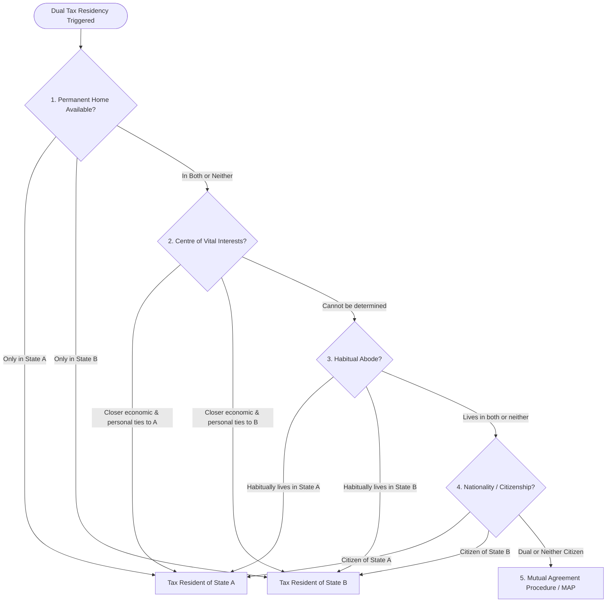

# Technical Specification: NomadTaxEngine 183-Day Rule, Tax Treaty Logic, and Compliance Certificate Generation

This document provides a comprehensive technical architecture and reference guide for WorkSphere's **NomadTaxEngine** ([src/lib/tax/nomadTaxEngine.ts](file:///c:/Users/Rushabh%20Mahajan/Documents/GitHub/WorkSphere/src/lib/tax/nomadTaxEngine.ts), [src/components/billing/NomadTaxComplianceDashboard.tsx](file:///c:/Users/Rushabh%20Mahajan/Documents/GitHub/WorkSphere/src/components/billing/NomadTaxComplianceDashboard.tsx), and [src/app/api/tax/nomad-compliance/route.ts](file:///c:/Users/Rushabh%20Mahajan/Documents/GitHub/WorkSphere/src/app/api/tax/nomad-compliance/route.ts)).

---

## Table of Contents

1. [Executive Summary & Regulatory Scope](#1-executive-summary--regulatory-scope)
2. [Architectural Overview](#2-architectural-overview)
3. [183-Day Physical Presence & Tax Residency Engine](#3-183-day-physical-presence--tax-residency-engine)
   - [Calendar Normalization Protocol](#calendar-normalization-protocol)
   - [Presence Accumulation & Thresholds](#presence-accumulation--thresholds)
   - [Risk Classification Framework](#risk-classification-framework)
4. [Transitional Travel Day Collision Resolution Algorithm](#4-transitional-travel-day-collision-resolution-algorithm)
   - [The Multi-Jurisdiction Travel Day Collision Problem](#the-multi-jurisdiction-travel-day-collision-problem)
   - [Resolution Heuristics & OECD Conventions](#resolution-heuristics--oecd-conventions)
   - [Double-Counting Invariant Proof](#double-counting-invariant-proof)
5. [Double Taxation Treaty Logic & Tie-Breaker Rules](#5-double-taxation-treaty-logic--tie-breaker-rules)
   - [OECD Model Tax Convention Article 4 Tie-Breakers](#oecd-model-tax-convention-article-4-tie-breakers)
   - [Permanent Establishment & 183-Day Employment Rules (Article 15)](#permanent-establishment--183-day-employment-rules-article-15)
6. [Rolling Schengen 90/180-Day Visa Stay Engine](#6-rolling-schengen-90180-day-visa-stay-engine)
   - [180-Day Moving Window Algorithm](#180-day-moving-window-algorithm)
   - [Schengen Member Jurisdiction Matrix](#schengen-member-jurisdiction-matrix)
7. [Compliance Certificate, Dossier & Tax Export Generation](#7-compliance-certificate-dossier--tax-export-generation)
   - [Automated Compliance Dossier Pipeline](#automated-compliance-dossier-pipeline)
   - [VAT/GST Deduction & Reclaim Calculations](#vatgst-deduction--reclaim-calculations)
   - [Audited CSV & PDF Dossier Export Formats](#audited-csv--pdf-dossier-export-formats)
8. [API Route Specifications & Data Contracts](#8-api-route-specifications--data-contracts)
   - [`GET /api/tax/nomad-compliance`](#get-apitaxnomad-compliance)
   - [`POST /api/tax/nomad-compliance`](#post-apitaxnomad-compliance)
9. [Repository Code Reference Map](#9-repository-code-reference-map)

---

## 1. Executive Summary & Regulatory Scope

Cross-border remote work and digital nomadism introduce significant regulatory complexity across two distinct legal frameworks:
1. **Tax Residency & Double Taxation Treaties (OECD / UN Model Conventions)**: The statutory **183-day physical presence rule** adopted by most jurisdictions stipulates that an individual residing within a nation for 183 or more days in a calendar year (or consecutive 12-month rolling period) becomes subject to worldwide income tax liability in that host state.
2. **Immigration & Short-Stay Visa Quotas (Schengen Border Code)**: Non-EU/EEA nationals are limited to **90 days within any rolling 180-day window** across the 29 Schengen member countries.

WorkSphere's **NomadTaxEngine** automatically audits verified workspace check-ins, resolve multi-country travel day collisions without duplicate day counting, flags accidental tax residency hazards, evaluates bilateral double tax treaty exposure, and generates certified audit dossiers for tax authorities, payroll departments, and accountants.

```
┌─────────────────────────────────────────────────────────────────────────────┐
│                          NOMAD TAX ENGINE DATA PIPELINE                     │
└─────────────────────────────────────────────────────────────────────────────┘
                                       │
            ┌──────────────────────────┴──────────────────────────┐
            ▼                                                     ▼
┌───────────────────────────────┐             ┌───────────────────────────────┐
│     Verified Workspace Logs   │             │     Border / Itinerary Logs   │
│  - GPS Check-in Telemetry     │             │  - Arrival / Departure Stamps │
│  - Booking Invoices & VAT/GST │             │  - Flight / Train Transitions │
└───────────────┬───────────────┘             └───────────────┬───────────────┘
                │                                             │
                └──────────────────────┬──────────────────────┘
                                       │
                                       ▼
┌─────────────────────────────────────────────────────────────────────────────┐
│                       NomadTaxEngine Core Analysis                          │
│  1. Date Normalization (toCalendarDateString)                               │
│  2. Multi-Jurisdiction Collision Resolution (Destination/Arrival Priority)  │
│  3. 183-Day Tax Residency Risk Analysis (LOW / WARNING / CRITICAL)          │
│  4. Schengen 90/180 Rolling Moving Window Calculator                        │
│  5. VAT/GST Workspace Expense Aggregate                                     │
└──────────────────────────────────────┬──────────────────────────────────────┘
                                       │
            ┌──────────────────────────┴──────────────────────────┐
            ▼                                                     ▼
┌───────────────────────────────┐             ┌───────────────────────────────┐
│  NomadTaxComplianceDashboard  │             │   Compliance Dossier Export   │
│  - Real-time Quota Gauges     │             │   - Tax-Deductible CSV Export │
│  - Country Stay Breakdown     │             │   - Certified PDF Audit Proof │
└───────────────────────────────┘             └───────────────────────────────┘
```

---

## 2. Architectural Overview

The compliance suite is implemented in three primary modules:
- **Domain Engine** ([src/lib/tax/nomadTaxEngine.ts](file:///c:/Users/Rushabh%20Mahajan/Documents/GitHub/WorkSphere/src/lib/tax/nomadTaxEngine.ts)): Pure algorithmic engine responsible for calendar date grouping, collision arbitration, moving window aggregations, and CSV formatting.
- **Client Visualization** ([src/components/billing/NomadTaxComplianceDashboard.tsx](file:///c:/Users/Rushabh%20Mahajan/Documents/GitHub/WorkSphere/src/components/billing/NomadTaxComplianceDashboard.tsx)): Interactive dashboard providing real-time visual feedback, quota progress bars, country expense breakdowns, and export triggers.
- **REST Gateway** ([src/app/api/tax/nomad-compliance/route.ts](file:///c:/Users/Rushabh%20Mahajan/Documents/GitHub/WorkSphere/src/app/api/tax/nomad-compliance/route.ts)): Next.js App Router endpoints handling database queries, on-demand collision computations, and downloadable file generation.

---

## 3. 183-Day Physical Presence & Tax Residency Engine

### Calendar Normalization Protocol

To prevent timezone distortion across global travelers (e.g., flight departures at 23:30 UTC), all timestamps are normalized to ISO `YYYY-MM-DD` strings via UTC extraction:

```typescript
export function toCalendarDateString(timestamp: string): string {
  const date = new Date(timestamp);
  if (isNaN(date.getTime())) {
    throw new Error(`Invalid timestamp string: ${timestamp}`);
  }
  return date.toISOString().split("T")[0];
}
```

### Presence Accumulation & Thresholds

For each jurisdiction $j$, the total physical presence $D_j$ is calculated as the cardinality of unique calendar days:

$$D_j = \left| \{ d \in \text{CalendarDays}(\text{taxYear}) \mid \text{AllocatedCountry}(d) = j \} \right|$$

$$\text{DaysRemaining}_j = \max(0, 183 - D_j)$$

### Risk Classification Framework

| Risk Level | Day Count Range ($D_j$) | Remaining Days to 183 | System Behavior & Action |
| :--- | :--- | :--- | :--- |
| `LOW` | $0 \le D_j \le 152$ | $> 30$ days left | Compliant status badge; green gauge; standard tracking. |
| `WARNING` | $153 \le D_j \le 182$ | $1 \le \text{Remaining} \le 30$ | Amber alert banner; recommended departure countdown; tax treaty review notification. |
| `CRITICAL` | $D_j \ge 183$ | $0$ days left | Red emergency flag; critical tax residency warning generated in report; potential local tax return filing obligation. |

---

## 4. Transitional Travel Day Collision Resolution Algorithm

### The Multi-Jurisdiction Travel Day Collision Problem

Digital nomads frequently check in at a coworking space in one country in the morning, board a flight/train, and arrive at a new destination in another country on the exact same UTC calendar date.

Naive presence tracking would count 1 day for Country A and 1 day for Country B, resulting in $1 + 1 = 2$ physical days logged for a single 24-hour calendar day. This violates OECD tax counting rules and artificially accelerates the 183-day counter.

```
Calendar Date: 2026-04-11
08:00 UTC ──> Check-in: Betahaus Barcelona, Spain (ES) [isDeparture: true]
21:30 UTC ──> Check-in: Second Home Lisbon, Portugal (PT) [isArrival: true]
─────────────────────────────────────────────────────────────────────────────
Naive Sum:   1 Day Spain + 1 Day Portugal = 2 Days (DOUBLE COUNTING ERROR)
Engine Sum:  0 Days Spain + 1 Day Portugal = 1 Day (ACCURATE OECD RESOLUTION)
```

### Resolution Heuristics & OECD Conventions

When `uniqueCountriesOnDay.length > 1`, `NomadTaxEngine` resolves the conflict using deterministic heuristics:

1. **Explicit Arrival Priority (`isArrival`)**: If an entry is explicitly tagged with `isArrival: true` (e.g. airport passport control, arrival hotel check-in), the entire day is allocated to the arrival destination.
2. **Destination Priority (`DESTINATION_PRIORITY` - Default)**: Sorts day entries by timestamp descending; allocates the calendar day to the country of the latest timestamp (where the nomad ends the day).
3. **Origin Priority (`FIRST_TIMESTAMP`)**: Sorts day entries by timestamp ascending; allocates the day to the country of departure.

```typescript
if (uniqueCountriesOnDay.length > 1) {
  const arrivalEntry = dayEntries.find((e) => e.isArrival);
  if (arrivalEntry) {
    allocatedEntry = arrivalEntry;
  } else if (collisionRule === "FIRST_TIMESTAMP") {
    allocatedEntry = [...dayEntries].sort(
      (a, b) => new Date(a.timestamp).getTime() - new Date(b.timestamp).getTime()
    )[0];
  } else {
    allocatedEntry = [...dayEntries].sort(
      (a, b) => new Date(b.timestamp).getTime() - new Date(a.timestamp).getTime()
    )[0];
  }

  collisions.push({
    date: dateKey,
    conflictingCountries: uniqueCountriesOnDay,
    allocatedCountry: allocatedEntry.countryCode,
    resolutionReason: arrivalEntry
      ? `Arrival priority allocated to ${allocatedEntry.jurisdiction} (${allocatedEntry.countryCode})`
      : `Transitional travel day collision resolved to destination ${allocatedEntry.jurisdiction} (${allocatedEntry.countryCode}) based on latest timestamp`,
  });
}
```

### Double-Counting Invariant Proof

Let $\mathcal{D}$ be the set of unique calendar dates with at least one check-in. The engine guarantees:

$$\sum_{j \in \text{Jurisdictions}} D_j = |\mathcal{D}|$$

Every physical calendar date is mapped onto **exactly one** jurisdiction, preventing tax presence inflation.

---

## 5. Double Taxation Treaty Logic & Tie-Breaker Rules

### OECD Model Tax Convention Article 4 Tie-Breakers

When a digital nomad exceeds the 183-day threshold in a host country while maintaining continuous tax residency in their home nation, a **Dual Residency Conflict** arises. 

Bilateral Double Tax Avoidance Agreements (DTAAs) based on OECD Article 4 resolve dual residency through an established hierarchical tie-breaker sequence:



1. **Permanent Home (`Article 4(2)(a)`)**: The state where the individual has a permanent home available for their continuous personal use.
2. **Centre of Vital Interests (`Article 4(2)(a)`)**: The state with which their personal, social, and economic relations are closer (family, banking, company incorporation).
3. **Habitual Abode (`Article 4(2)(b)`)**: The state where the individual spends greater cumulative duration.
4. **Nationality (`Article 4(2)(c)`)**: The state of which the individual is a national.
5. **Mutual Agreement Procedure (`Article 4(2)(d)`)**: Direct arbitration between the competent tax authorities of both contracting states.

### Permanent Establishment & 183-Day Employment Rules (Article 15)

Under OECD Article 15 (Income from Employment), employment income is taxable only in the home state unless employment is exercised in the host state. The host state cannot tax the employment income if all three conditions are satisfied:
1. The employee is present in the host state for $\le 183$ days in any 12-month period;
2. The remuneration is paid by an employer not resident in the host state;
3. The remuneration is not borne by a Permanent Establishment (PE) of the employer in the host state.

---

## 6. Rolling Schengen 90/180-Day Visa Stay Engine

### 180-Day Moving Window Algorithm

The Schengen short-stay quota is not evaluated per calendar year, but across a **dynamic rolling 180-day lookback window**:

```typescript
export function calculateSchengenStay(
  records: NomadCheckInRecord[],
  referenceDate = new Date()
): VisaZoneLimit {
  const windowDays = 180;
  const maxDays = 90;
  const windowStart = new Date(referenceDate);
  windowStart.setDate(windowStart.getDate() - windowDays);

  const uniqueSchengenDates = new Set<string>();

  records.forEach((r) => {
    if (r.isSchengen || SCHENGEN_COUNTRIES.has(r.countryCode.toUpperCase())) {
      const recordDate = new Date(r.date);
      if (recordDate >= windowStart && recordDate <= referenceDate) {
        uniqueSchengenDates.add(r.date);
      }
    }
  });

  const daysUsed = uniqueSchengenDates.size;
  const daysRemaining = Math.max(0, maxDays - daysUsed);
  let status: VisaZoneLimit["status"] = "SAFE";
  if (daysRemaining <= 14) status = "CRITICAL_LIMIT";
  else if (daysRemaining <= 30) status = "WARNING";

  return {
    zoneName: "Schengen Area (90/180 Rule)",
    maxDays,
    windowDays,
    daysUsed,
    daysRemaining,
    status,
    taxResidencyRisk: daysUsed >= 85,
  };
}
```

### Schengen Member Jurisdiction Matrix

The engine maintains a 29-member ISO country code set:

```
AT (Austria), BE (Belgium), BG (Bulgaria), HR (Croatia), CY (Cyprus), CZ (Czechia),
DK (Denmark), EE (Estonia), FI (Finland), FR (France), DE (Germany), GR (Greece),
HU (Hungary), IS (Iceland), IT (Italy), LV (Latvia), LI (Liechtenstein), LT (Lithuania),
LU (Luxembourg), MT (Malta), NL (Netherlands), NO (Norway), PL (Poland), PT (Portugal),
RO (Romania), SK (Slovakia), SI (Slovenia), ES (Spain), SE (Sweden), CH (Switzerland)
```

---

## 7. Compliance Certificate, Dossier & Tax Export Generation

### Automated Compliance Dossier Pipeline

The `generateNomadComplianceReport(records, taxYear)` function consolidates physical presence, Schengen quotas, and expense logs into an immutable audit snapshot:

```typescript
export interface NomadComplianceReport {
  taxYear: number;
  schengenStay: VisaZoneLimit;
  countryBreakdown: Array<{
    country: string;
    countryCode: string;
    daysSpent: number;
    daysRemaining183Rule: number;
    taxResidencyRisk: boolean;
    totalSpent: number;
    vatReclaimable: number;
    currency: string;
  }>;
  totalWorkspaceExpense: number;
  totalVatReclaimable: number;
  currency: string;
  generatedAt: string;
}
```

### VAT/GST Deduction & Reclaim Calculations

For each qualifying coworking booking, the engine calculates the input Value-Added Tax (VAT) or Goods & Services Tax (GST) eligible for business expense deduction or cross-border refund under the EU 8th and 13th Directives:

$$\text{VAT}_{\text{Reclaimable}} = \sum_{b \in \text{Bookings}} \text{AmountSpent}_b \times \left( \frac{\text{VATRatePct}_b}{100} \right)$$

Typical statutory rates tracked:
- Portugal (`PT`): $23\%$
- Spain (`ES`): $21\%$
- Germany (`DE`): $19\%$
- United Kingdom (`GB`): $20\%$
- Japan (`JP`): $10\%$

### Audited CSV & PDF Dossier Export Formats

Generated CSV dossiers include explicit headers and summary reconciliations:

```csv
Jurisdiction,Country Code,Days In-Country,Days to 183-Tax Trigger,Tax Risk Flag,Total Workspace Expense (USD),Estimated VAT/GST Reclaim (USD)
"Portugal",PT,25,158,SAFE,220.00,50.60
"Spain",ES,12,171,SAFE,310.00,65.10
"Germany",DE,2,181,SAFE,180.00,34.20
"Japan",JP,1,182,SAFE,450.00,45.00

"Schengen 90/180 Status","39 / 90 Days Used (51 Remaining)","Status: SAFE"
"Total Tax Deductible Workspace Expenses","USD 1160.00"
"Total Reclaimable VAT/GST","USD 194.90"
```

---

## 8. API Route Specifications & Data Contracts

### `GET /api/tax/nomad-compliance`

Generates an aggregated compliance report for the authenticated user for a specified tax year.

**Query Parameters:**
- `userId` (string, optional): Target user identifier.
- `year` (number, optional, default: current year): Four-digit tax calendar year (e.g. `2026`).

**Response Payload:**
```json
{
  "success": true,
  "report": {
    "taxYear": 2026,
    "schengenStay": {
      "zoneName": "Schengen Area (90/180 Rule)",
      "maxDays": 90,
      "windowDays": 180,
      "daysUsed": 39,
      "daysRemaining": 51,
      "status": "SAFE",
      "taxResidencyRisk": false
    },
    "countryBreakdown": [
      {
        "country": "Portugal",
        "countryCode": "PT",
        "daysSpent": 25,
        "daysRemaining183Rule": 158,
        "taxResidencyRisk": false,
        "totalSpent": 220.0,
        "vatReclaimable": 50.6,
        "currency": "USD"
      }
    ],
    "totalWorkspaceExpense": 1160.0,
    "totalVatReclaimable": 194.9,
    "currency": "USD",
    "generatedAt": "2026-10-10T10:38:00.000Z"
  },
  "recordsCount": 4
}
```

---

### `POST /api/tax/nomad-compliance`

Accepts raw physical presence entries to resolve collisions, or exports formatted CSV dossiers.

**Payload A: Physical Presence Collision Resolution**
```json
{
  "taxYear": 2026,
  "collisionRule": "DESTINATION_PRIORITY",
  "entries": [
    {
      "id": "e1",
      "userId": "nomad-42",
      "countryCode": "ES",
      "jurisdiction": "Spain",
      "timestamp": "2026-04-11T08:00:00Z",
      "isDeparture": true
    },
    {
      "id": "e2",
      "userId": "nomad-42",
      "countryCode": "PT",
      "jurisdiction": "Portugal",
      "timestamp": "2026-04-11T21:30:00Z",
      "isArrival": true
    }
  ]
}
```

**Response A:**
```json
{
  "success": true,
  "report": {
    "userId": "nomad-42",
    "taxYear": 2026,
    "totalUniqueCalendarDays": 1,
    "collisionsResolvedCount": 1,
    "jurisdictions": [
      {
        "countryCode": "PT",
        "jurisdiction": "Portugal",
        "daysCount": 1,
        "isTaxResidentRisk": false,
        "daysRemainingBefore183": 182,
        "riskLevel": "LOW"
      }
    ],
    "collisions": [
      {
        "date": "2026-04-11",
        "conflictingCountries": ["ES", "PT"],
        "allocatedCountry": "PT",
        "resolutionReason": "Arrival priority allocated to Portugal (PT)"
      }
    ],
    "warnings": []
  }
}
```

---

## 9. Repository Code Reference Map

- Core Tax Engine: [src/lib/tax/nomadTaxEngine.ts](file:///c:/Users/Rushabh%20Mahajan/Documents/GitHub/WorkSphere/src/lib/tax/nomadTaxEngine.ts)
- Compliance Dashboard Component: [src/components/billing/NomadTaxComplianceDashboard.tsx](file:///c:/Users/Rushabh%20Mahajan/Documents/GitHub/WorkSphere/src/components/billing/NomadTaxComplianceDashboard.tsx)
- REST API Endpoint: [src/app/api/tax/nomad-compliance/route.ts](file:///c:/Users/Rushabh%20Mahajan/Documents/GitHub/WorkSphere/src/app/api/tax/nomad-compliance/route.ts)
- Analytics Page: [src/app/analytics/nomad-tax/page.tsx](file:///c:/Users/Rushabh%20Mahajan/Documents/GitHub/WorkSphere/src/app/analytics/nomad-tax/page.tsx)
- Unit & Collision Tests: [src/__tests__/lib/nomadTaxEngine.test.ts](file:///c:/Users/Rushabh%20Mahajan/Documents/GitHub/WorkSphere/src/__tests__/lib/nomadTaxEngine.test.ts)
- Tax Exporter Domain Utility: [src/lib/export/domain/taxExporter.ts](file:///c:/Users/Rushabh%20Mahajan/Documents/GitHub/WorkSphere/src/lib/export/domain/taxExporter.ts)
