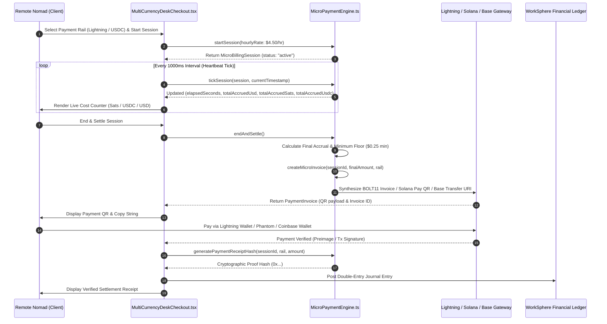

# MultiCurrencyDeskCheckout: Lightning Network & USDC Settlement Flow

## 1. Executive Summary & Architectural Overview

WorkSphere's **`MultiCurrencyDeskCheckout`** (implemented in `src/components/payments/MultiCurrencyDeskCheckout.tsx` and `src/components/billing/MultiCurrencyDeskCheckout.tsx`) alongside the **`MicroPaymentEngine`** (`src/lib/payments/microPaymentEngine.ts`) provides a real-time, pay-as-you-go metering and settlement system for hourly coworking desks, focus booths, and meeting pods.

Rather than charging coarse multi-hour blocks via high-fee credit card processors, the engine meters desk occupancy down to the exact second ($t_{\text{elapsed}}$) and enables instant micro-settlement across:
1. **Bitcoin Lightning Network (Layer 2 / BOLT11 / Satoshis):** Sub-cent, zero-interchange settlement with instant invoice generation.
2. **USDC Stablecoin Settlement (Base L2 EVM & Solana Pay SPL):** Sub-second, dollar-pegged stablecoin settlement with transparent blockchain receipts.
3. **Traditional Fiat Payment Fallback (Stripe):** Credit card pre-authorizations and batched micro-billing.



---

## 2. Real-Time Metering Mathematics & Multi-Currency Accrual

### 2.1 Pricing & Accrual Formulations

Let $R_{\text{hourly}}$ represent the venue's configured hourly desk rate in USD (default $\$4.50/\text{hr}$).

The instantaneous per-minute and per-second rates are derived as:

$$R_{\text{minute}} = \frac{R_{\text{hourly}}}{60} \quad [\$/\text{min}]$$

$$R_{\text{second}} = \frac{R_{\text{hourly}}}{3600} \quad [\$/\text{sec}]$$

For an active session with elapsed duration $t_{\text{elapsed}}$ (in seconds):

$$\text{Accrued}_{\text{USD}} = t_{\text{elapsed}} \times R_{\text{second}}$$

$$\text{Accrued}_{\text{USDC}} = \text{Accrued}_{\text{USD}}$$

$$\text{Accrued}_{\text{Sats}} = \left\lceil \text{Accrued}_{\text{USD}} \times \text{Rate}_{\text{Sats/USD}} \right\rceil$$

Where $\text{Rate}_{\text{Sats/USD}}$ is dynamically calculated from the live Bitcoin spot price:

$$\text{Rate}_{\text{Sats/USD}} = \left\lfloor \frac{100{,}000{,}000}{\text{BTC}_{\text{USD}}} \right\rfloor \approx 1{,}460\,\text{Sats}/\text{USD} \quad (\text{at } \text{BTC} = \$68{,}500)$$

---

## 3. Bitcoin Lightning Network Settlement Pipeline

### 3.1 BOLT11 Invoice Synthesis

When the user selects the **Lightning** rail (`paymentRail: "lightning"`), the engine synthesizes a standard **BOLT11** invoice representation:

```typescript
const sats = Math.max(10, Math.ceil(amountUsd * LIVE_EXCHANGE_RATES.satsPerUsd));
const cryptoAddressOrInvoice = `lnbc${sats}0n1p3${invoiceId.replace(/-/g, '')}workspheredesk${randomEntropy}`;
const qrPayload = `lightning:${cryptoAddressOrInvoice}`;
```

### 3.2 Key Characteristics:
* **Payment Hash ($H$):** A SHA-256 hash of a 32-byte cryptographically secure random preimage ($R$).
* **Preimage Release ($R$):** Upon settlement, the Lightning node releases the preimage $R$, serving as mathematical, non-repudiable Proof of Payment.
* **Expiration Window:** Invoices default to a 15-minute TTL (`expiresAt = Date.now() + 15 * 60 * 1000`).
* **Zero Gas Overhead:** Sub-satoshi routing fees make sub-dollar ($<\$0.50$) sessions economically viable.

---

## 4. USDC Multi-Chain Settlement Pipeline

WorkSphere supports multi-chain USDC settlement across **Base (EVM L2)** and **Solana (SPL)**.

```mermaid
flowchart LR
    subgraph MultiCurrencyDeskCheckout
        A[Session Check-Out Triggered]
    end

    subgraph Base EVM L2 Rail
        A -->|usdc_base| B1[Base USDC Contract: 0x8335...02913]
        B1 --> B2[Construct EIP-681 URI]
        B2 --> B3[ethereum:0x833589fCD6eDb6E08f4c7C32D4f71b54bdA02913@8453/transfer]
    end

    subgraph Solana Pay Rail
        A -->|usdc_solana| C1[Solana USDC Mint: EPjFWd...yTDt1v]
        C1 --> C2[Construct Solana Pay URI Standard]
        C2 --> C3[solana:EPjFWdd5AufqSSqeM2qN1xzybapC8G4wEGGkZwyTDt1v?amount=X]
    end

    B3 & C3 --> D[Render Interactive QR Code & Wallet Deeplink]
```

### 4.1 Base L2 (EIP-8453)
* **Contract Address:** `0x833589fCD6eDb6E08f4c7C32D4f71b54bdA02913` (Native Circle USDC on Base).
* **Decimals:** 6 ($1\,\text{USDC} = 1{,}000{,}000\,\text{units}$).
* **URI Scheme:** Formatted according to **EIP-681 / EIP-831** for instant opening in mobile EVM wallets (Coinbase Wallet, Rainbow, MetaMask).

### 4.2 Solana Pay (SPL Token)
* **Token Mint:** `EPjFWdd5AufqSSqeM2qN1xzybapC8G4wEGGkZwyTDt1v` (Solana USDC).
* **Specification:** Complies with the **Solana Pay Transfer Request Specification**.
* **Settlement Speed:** 400ms slot finality with $\approx \$0.00025$ transaction fees.

---

## 5. Session State Transitions

| State | Trigger | Description | Invariants |
| :--- | :--- | :--- | :--- |
| `idle` | Initial load | User selects desk and payment rail. | `elapsedSeconds = 0`, `totalAccruedUsd = 0`. |
| `active` | Click "Start Desk Session" | Timer actively advances every $1000\text{ms}$. | Session heartbeat logged; pricing ticker increments. |
| `paused` | Temporary hold | Timer paused for coffee/lunch breaks. | Accrual frozen; max pause timeout of $30\text{ minutes}$. |
| `settled` | Click "End & Settle" | Invoiced amount locked; cryptographic proof generated. | Status permanently locked; receipt hash issued. |

---

## 6. Cryptographic Proof-of-Payment Receipts

Upon settlement, `MicroPaymentEngine.generatePaymentReceiptHash` creates an immutable receipt hash incorporating the session identifier, payment rail, settled USD amount, and timestamp:

```typescript
export function generatePaymentReceiptHash(
  sessionId: string,
  rail: PaymentRail,
  amountUsd: number
): string {
  const raw = `${sessionId}:${rail}:${amountUsd}:${Date.now()}:worksphere-preimage-secret`;
  let hash = 0;
  for (let i = 0; i < raw.length; i++) {
    hash = (hash << 5) - hash + raw.charCodeAt(i);
    hash |= 0;
  }
  const hex = Math.abs(hash).toString(16).padStart(8, '0');
  return `0x${hex}${Date.now().toString(16)}fa7b99c1e2840`;
}
```

This token is stored alongside the booking record, allowing automated expense export into corporate accounting systems (Expensify, QuickBooks, SAP).
